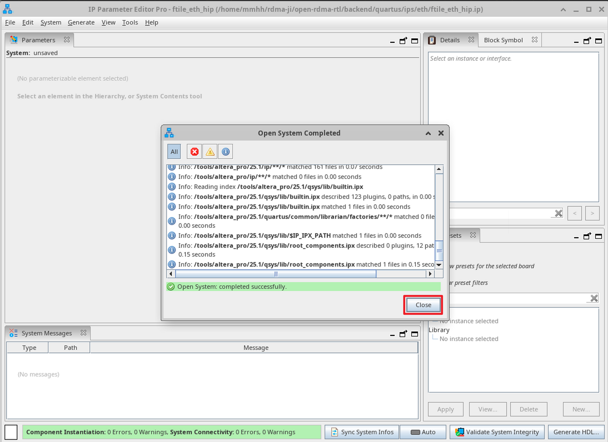
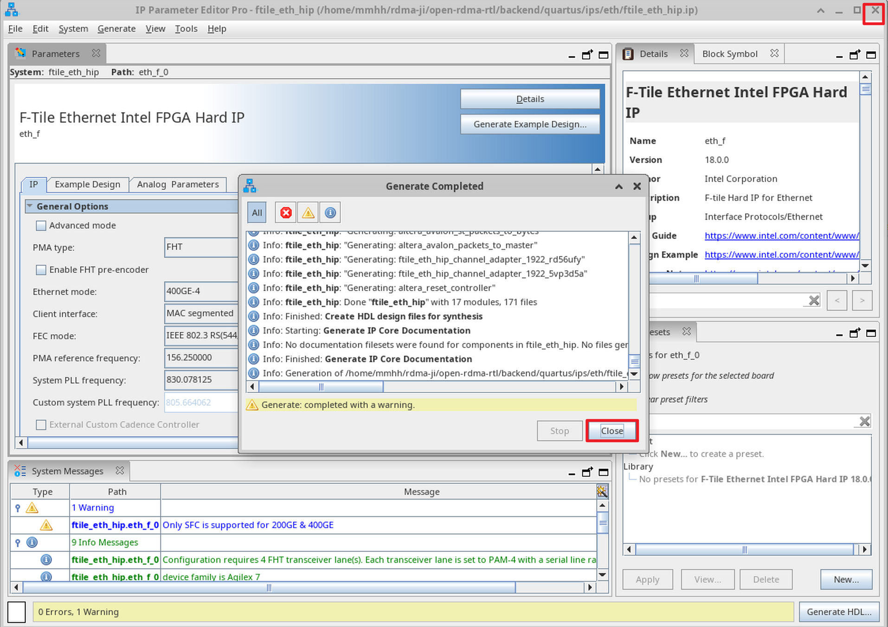
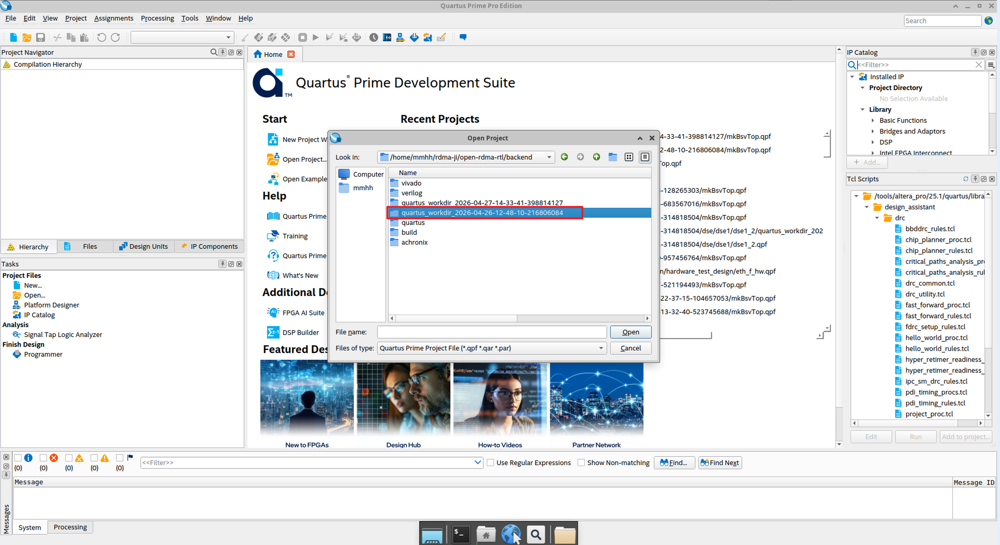
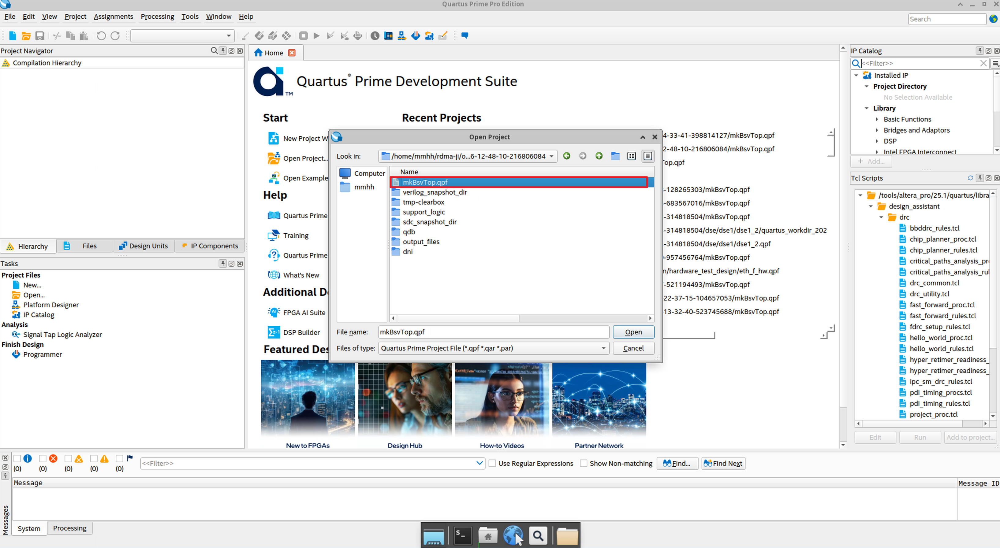
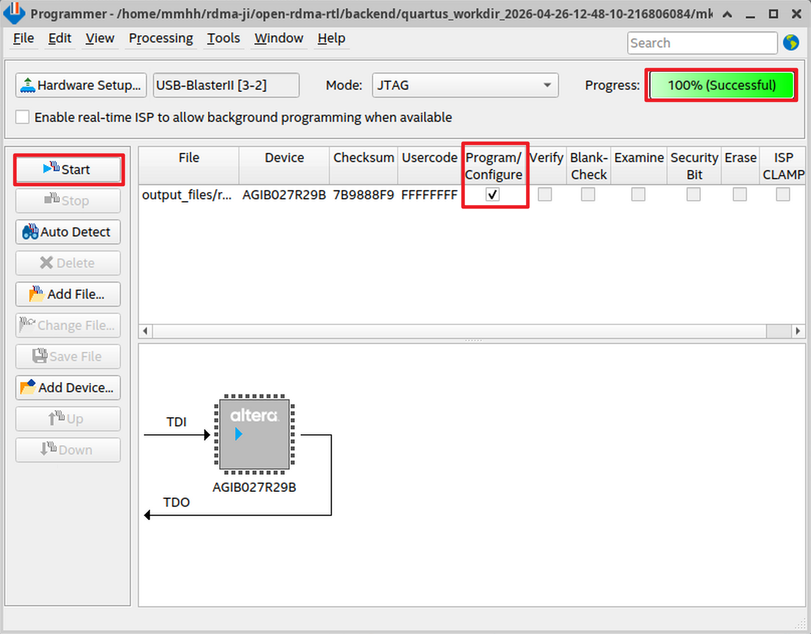
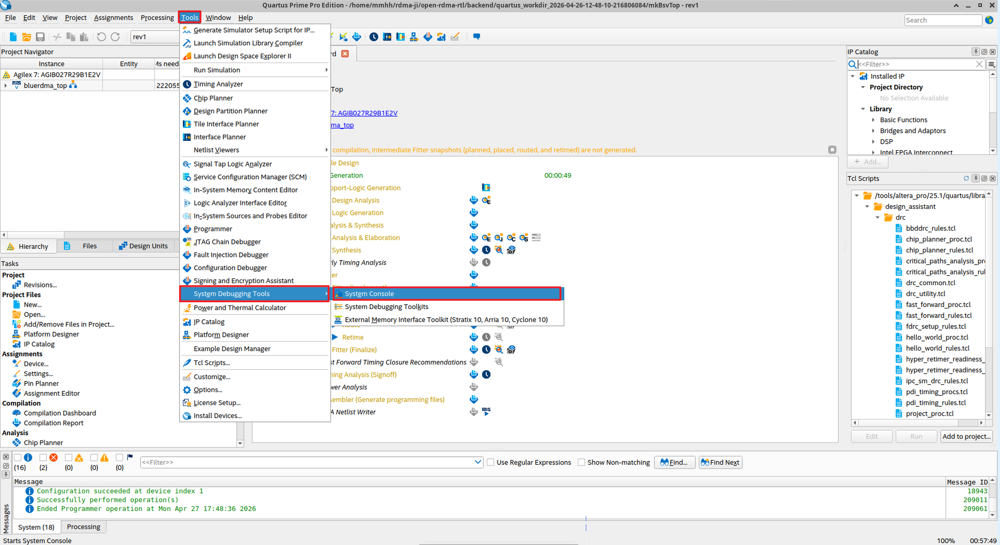
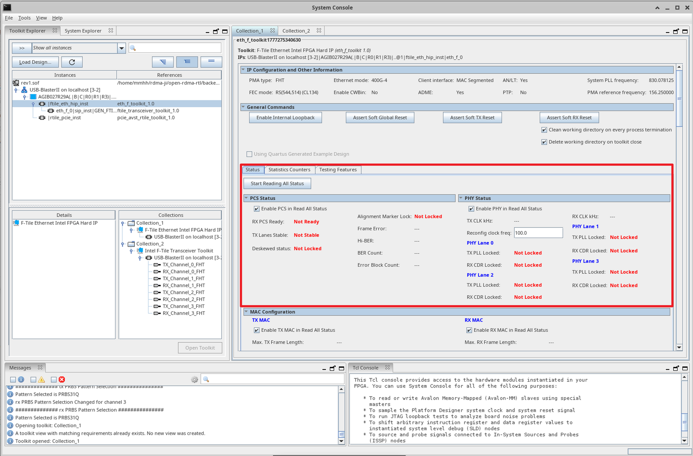

# FTile调试工程操作文档

## 配置IP核，开启debug tool

打开已综合好的后端工程，`quartus_workdir_时间戳`下的 `mkBsvTop.qpf` 工程，左侧 Project Navigator 窗口的右下角点击 IP Components：


双击 `ftile_eth_hip` IP核：


点击 close：



下滑勾选 Enable debug endpoint for transceiver toolkit 与 Enable debug endpoint for Ethernet toolkit 两个复选框，为 收发器工具包 和 以太网工具包 启用 debug 调试端点。之后点击右下角 Generate HDL 按钮：


弹出界面中勾选如下两个复选框，之后点击 Generate：


完成后点击 close，再关闭 IP核：



## 重新编译，综合，烧录用于FTile调试的工程

linux系统进入backend目录执行

```bash
make verilog
```

```bash
make quartus
```

打开 Quartus 软件，左上角 File - Open Project 打开工程，在新创建的带有时间戳的工作目录（`quartus_workdir_时间戳`）下打开 `mkBsvTop.qpf` 工程：





上方Tools工具栏打开Programmer —— 点击左上角Hardware Setup —— 选择USB-Blaster（选择合适的时钟频率） —— 添加 .sof 文件 —— 勾选 `Program/Configure` —— 点击 Start，待右上角进度显示 100%(Successful) 即新综合的工程烧录成功。



## System Console 启动

打开 System Console，点击上方 Tools —— System Debugging Tools —— System Console。System Console 本质是一个 JTAG 控制的寄存器读取仪表盘。



双击 file_eth_hip_inst eth_f_tookit_1.0（以太网调试工具包），打开调试界面：


## FTile 以太网 Debug Toolkit 指标解析



- **PCS Status（物理编码子层状态）**
  - **RX PCS Ready**：接受侧PCS层是否就绪。
  - **TX Lanes Stable**：发送通道是否稳定。
  - **Deskewed status**：多通道是否对齐。
  - **Alignment Marker Lock**：PCS层从接受数据流中识别出对齐标记并那个锁定的标志。
  - **Frame Error**：帧错误数。
  - **Hi-BER**：高误码率标志。
  - **BER Count**：误码率。
  - **Error Block Count**：错误块计数，FEC解码后仍存在错误的块数量。
- **PHY Status（物理层状态）**
  - **TX CLK kHz**：时钟频率。
  - **Reconfig clock freq**：重配置接口时钟频率，即 `ftile_eth_reconfig_clk` 的实际频率，100 MHz 是标准值。
  - **PHY Lane X**：每一条SerDes发送/接收通道的物理层状态。
    - **TX PLL Locked**：发送通道的锁相环状态。
    - **RX CDR Locked**：接收通道的时钟数据恢复状态。


- **MAC Configuration**：MAC层的配置寄存器和状态寄存器。


- **AN.LT（Auto-Negotiation / Link Training）**：显示 IEEE 802.3 标准定义的以太网端口间自动协商和链路训练的状态与配置信息。

# 顶层（top.v）时钟树

## 时钟树架构总览图


FTile（以太网子系统）与 RTile（PCIe 子系统）各自拥有独立的参考时钟源和锁相环。两者之间不存在共用 PLL 的情况，仅在用户逻辑层面通过跨时钟域处理进行交互。

## FTile时钟路径

由配置时钟、参考时钟和高速数据时钟三部分组成：

- **配置时钟**
  - **来源**：板载 100MHz 晶振输入。
  - **路径**：经过 IOPLL 倍频/分频后，生成 `ftile_eth_reconfig_clk`。
  - **作用**：该时钟频率较低且独立稳定，专门用于驱动 FTile 的重配置接口及复位模块，不参与高速数据路径，确保配置过程的稳定性。
- **参考时钟**
  - **来源**：来自 QSFPDD 光模块连接器的 `qsfpdd_refclk_fgt` 和 `qsfpdd_refclk_fht`。
  - **路径**：这两路时钟经过同步处理后，分别作为系统时钟和参考时钟输入到 FTile 内部。
- **高速数据时钟**
  - **来源**：由 FTile Ethernet HIP 内部的 PLL 生成。
  - **路径**：内部 PLL 锁定后输出 `ftile_eth_clk_pll`。
  - **作用**：该时钟同时作为 FTile 的 TX/RX 串行数据通路时钟，向用户逻辑提供 `CLK_ftileClk`。

## RTile 时钟路径

RTile 的时钟路径相对直接，专注于 PCIe 链路的稳定性：

- **参考时钟**
  - **来源**：通常来自 PCIe 金手指的差分时钟，或者板载晶振。
  - **路径**：输入至 RTile 的 PCIe HIP 模块。
- **核心时钟**
  - **来源**：由 RTile PCIe HIP 内部的 PLL 生成。
  - **路径**：生成 `rtile_pcie_coreclkout_hip`，并输出至顶层 `mkBsvTop.CLK`。
  - **作用**：驱动 PCIe 核心逻辑及用户接口。

## FTile 与 RTile 的关系

### 功能定位

- **RTile**：实现 PCI Express 协议栈（R‑Tile PCIe Hard IP），完成主机与 FPGA 之间的 DMA 数据传输。
- **FTile**：实现高速以太网协议栈（F‑Tile Ethernet Hard IP），负责网络侧的数据收发（如 100G/400G）。
- 两者在芯片内部占用不同的物理资源，引脚也不重叠（PCIe 通道与 QSFPDD 通道独立），属于**设计上的解耦**。

### 时钟域完全隔离

- **RTile 时钟源**：外部 PCIe 参考时钟（`pcie_ep_refclk0/1`），直接送入 RTile IP，由其内部 PLL 生成用户侧接口时钟 `rtile_pcie_coreclkout_hip`。
- **FTile 时钟源**：外部 QSFPDD 参考时钟（`qsfpdd_refclk_fgt/fht`）通过 `system_clk_and_ftile_ref_clk` 生成 `ftile_eth_clk_sys` 和 `ftile_eth_clk_ref`，最终由 FTile 内部 PLL 产生数据通路时钟 `ftile_eth_clk_pll`。
- **没有任何共用时钟**。IO PLL 产生的 `ftile_eth_reconfig_clk` 仅用于 FTile 的配置接口，与 RTile 无关。

### 复位逻辑存在级联依赖

复位顺序体现了 RTile 先稳定，FTile 后释放的依赖关系。

这保证了 PCIe 侧电源与时钟稳定后，才允许以太网侧退出复位状态，符合板级电源时序要求。

### 数据通路通过用户逻辑（mkVsvTop）互联

- `mkBsvTop` 使用 **两个异步时钟**：
  - `CLK` = `rtile_pcie_coreclkout_hip`（PCIe 侧）
  - `CLK_ftileClk` = `ftile_eth_clk_pll`（Ethernet 侧）
- 用户逻辑内部通过 **跨时钟域（CDC）处理** 将 PCIe 的 TLP 数据与以太网的 MAC 帧进行转换、封装和转发。
- 因此，FTile 和 RTile **在物理和时序上完全解耦，仅在逻辑功能上通过 CDC 桥梁完成数据包“接力”**。

### 架构优点

稳定性高：一侧链路的速率变化或时钟抖动不会影响另一侧，同时便于独立调试和升级。

# ftile_reset.v——复位同步与握手释放模块

`ftile_reset` 是介于 RTile PCIe 硬核与 FTile Ethernet 硬核之间的 **复位同步与握手释放专用模块**。它负责将来自 RTile 侧的全局复位信号安全地传递到 FTile 时钟域，并通过硬件握手协议确保 FTile 内部电源、PLL 及校准电路全部就绪后，才正式释放复位信号。该模块是实现系统级可靠复位时序的关键桥梁。

如果直接把 `rtile_pcie_pin_perst_n_o` 接到 FTile 的 `i_rst_n`，会有以下风险：

- **时序风险**：FTile 内部的 PLL 和电源可能尚未稳定，提前释放复位会导致链路训练失败或不可靠。
- **跨时钟域问题**：`rtile_pcie_pin_perst_n_o` 处于 RTile 时钟域，直接接入 FTile 时钟域可能产生亚稳态。
- **缺少握手**：无法确保 FTile IP 已经完成了自检和校准（这些在 `rst_ack_n` 拉低之前可能未完成）。

该模块保证了系统级上电顺序的严格性。

# rtile_reset_output_buffer.v解析

`rtile_reset_output_buffer` 是介于 RTile PCIe 硬核与用户逻辑（`mkBsvTop`）之间的**复位信号同步缓冲器**。它将来自 PCIe 物理层的动态复位状态信号 `p0_reset_status_n` 通过四级移位寄存器同步到用户逻辑时钟域，在消除亚稳态的同时实现毛刺过滤和扇出缓冲，为整个用户设计提供稳定可靠的全局复位源。

- **打四拍**：
  - **高扇出复位网络的物理实现需要**：将复位信号的传播拆分到多个时钟周期内逐步扩大扇出范围。Quartus 的 Fitter 工具可以在这四级寄存器之间插入逐级放大的缓冲区，使得每一级的负载都在可控范围内，极大缓解了全局网络的时序收敛压力。
  - **PCIe硬核复位信号的“防抖动”过滤**：多级延迟等效于低通滤波，确保只有持续稳定的复位释放（高电平）才会传递到 `o_reset_n`，避免链路训练瞬间的毛刺导致用户逻辑误复位。
  - **跨时钟域同步**：`i_reset_n` 来自 `rtile_pcie_p0_reset_status_n`，它是 PCIe 控制器内部产生的“物理层已就绪”标志，可能随 PCIe 链路训练过程在不同时钟域变化。该模块通过 4 级移位寄存器将其同步到 `rtile_pcie_coreclkout_hip`（用户逻辑主时钟）域，消除亚稳态。

这样，`mkBsvTop` 获得的 `RST_N` 是经过严格同步且无毛刺的复位信号，保证了用户逻辑与 PCIe 硬核之间复位释放顺序的正确性，避免在链路不稳定时过早启动业务逻辑。