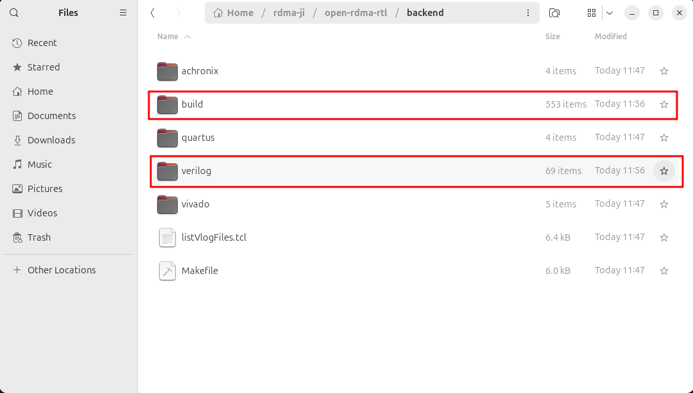
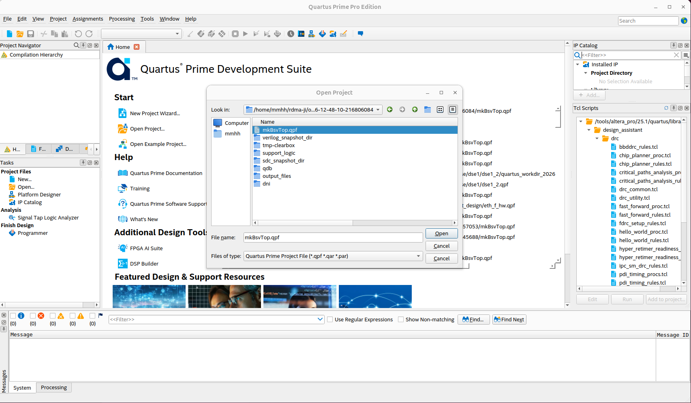
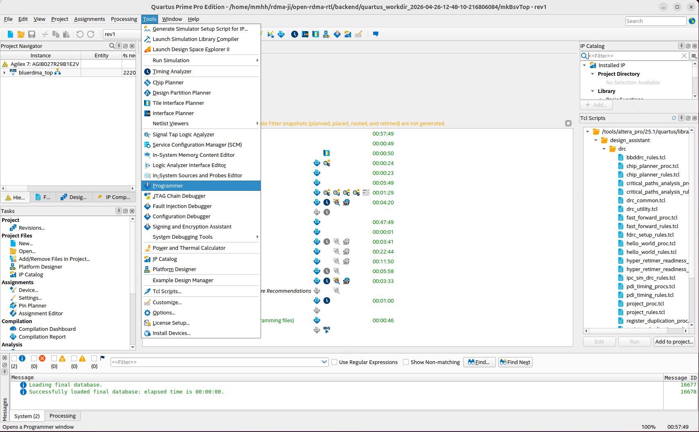
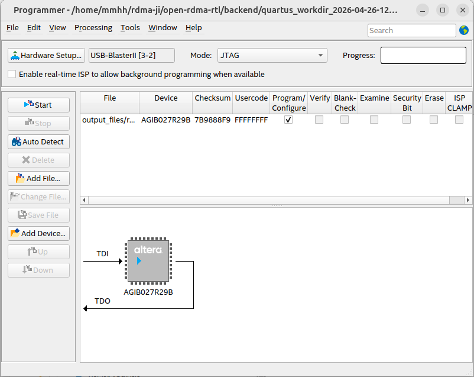
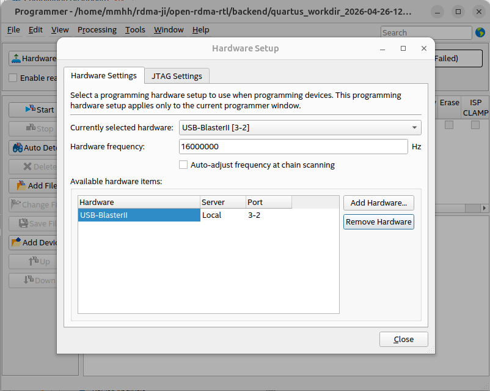

# From Source Code to FPGA Bitstream: Operation Guide

## Compiling RTL Source Code

On a Linux system, enter the `backend` directory and execute:

```bash
make verilog
```

You can see the newly created `build` and `verilog` folders after compilation:



## Launching Backend Synthesis Tools

Here we take Quartus as an example. Execute in the `backend` directory:

bash

```
make quartus
```


A working directory with a timestamp is created:


Open this working directory. `output_files` stores the `.sof` file for subsequent device programming. `sdc_snapshot_dir` holds snapshot copies of SDC timing constraint files. `verilog_snapshot_dir` holds snapshot copies of Verilog source files. `mkBsvTop.qpf` is the project file, and `rev1.qsf` is the settings file.


## Downloading the Program to the FPGA Board

Launch Quartus software. Go to File → Open Project and open the project. Navigate to the timestamped working directory (`quartus_workdir_timestamp`) and open the `mkBsvTop.qpf` project:



After opening, you will see the following. The two commands we executed above essentially perform the operations listed under Compilation Flow in the figure:


From the Tools menu, open Programmer:



Click Hardware Setup in the upper left corner:



Select USB-Blaster. If there is a problem with the USB-Blaster configuration, you can uncheck the “Auto-adjust frequency at chain scanning” checkbox and debug with a known working fixed clock.



Close Hardware Setup and click Add File:


Navigate into the `output_files` folder:


Add the `.sof` file:


Check `Program/Configure`:


Click Start. When the progress bar in the upper right corner shows 100% (Successful), the programming is complete.

# Introduction to the open-rdma Hardware RTL Repository Structure

- backend: backend project files directory
- docs: architecture diagrams
- src: source code
- test: test files
- Makefile.base: base configuration library

# Makefile.base — Base Compilation Configuration

`Makefile.base` is located in the `open-rdma-rtl` directory and serves as the **compilation configuration foundation** of the entire open-rdma hardware project. It defines all the common flags, paths, and parameters required by the Bluespec compiler `bsc`. It forms an inheritance relationship with the project-specific `Makefile` through `include`: the `Makefile` includes `../Makefile.base` on its first line, thereby obtaining all the base rules and variables, and then appends project-specific configurations such as device model, backend paths, and IP types.

This two-layer structure of "base configuration + project customization" implements a **highly parameterized build system**. `Makefile.base` mainly accomplishes the following:

- **Unifies Compiler Behavior**: Centrally manages flags for `bsc` such as transformation optimization (`TRANSFLAGS`), debug checks (`DEBUGFLAGS`), scheduling visualization (`SCHEDFLAGS`), and Verilog generation (`VERILOGFLAGS`), ensuring consistent compilation strategies across all modules.
- **Standardizes Directory Structure**: Uses variables like `BUILDDIR`, `OUTDIR`, and `WORKDIR` to place all intermediate files, output Verilog, and simulation files uniformly under the `build/` directory, separating generated products from source code.
- **Provides Simulation and Runtime Support**: Configures simulation parallel link count (`BLUESIMFLAGS`), maximum runtime stack size (`RUNTIMEFLAGS`), and integrates external C models (such as `MockHost.c`) to support hardware-software co-verification.
- **Defines Target Platform and IP Abstraction Variables**: Through variables like `BLUE_RDMA_DMA_IP_TYPE`, `BLUE_RDMA_ETH_IP_TYPE`, and `BLUERDMA_BUILD_TARGET`, combined with conditional statements, it automatically switches package search paths, macro definitions, and data bus widths for different hardware platforms (Xilinx 100G / Intel 400G) and IP selections (XDMA, Blue DMAC, R‑Tile DMAC, etc.).
- **Command-Line Generation Across the Entire Flow**: These variables are assembled into complete `bsc` invocation parameters in targets such as `compile` and `verilog`, allowing developers to generate Verilog code adapted to specific hardware from BSV source code with a single `make` command.

It is precisely due to `Makefile.base` that the open-rdma project achieves the flexible build capability of **"one set of RTL source code, multiple IPs, one-click target platform switching"**. It not only significantly reduces the risk of manual configuration errors but also provides accurate and stable high-level descriptions for subsequent steps involving backend synthesis tools such as Quartus and Vivado.

# Makefile — The Main Entry Point for Automated FPGA Build

## Overview

`backend/Makefile` is the **top-level build entry** for the entire open-rdma hardware project. It connects upstream to the Bluespec compilation flow and downstream to Intel Quartus or Xilinx Vivado backend implementation. Developers only need to execute simple `make` commands in the `backend/` directory to complete the entire automated flow from BSV source code to final FPGA bitstream (`.sof` / `.bit`).

This Makefile inherits common compiler flags and build rules via `include ../Makefile.base`, and extends backend-related variables, conditional branches, and dedicated targets for the specific needs of this project, forming a two-layer structure of "base configuration + project customization".

## Flow

### Defining Core Variables Required by Backend Build

Define core variables required for the backend build, such as working directories, source file paths, constraint file paths, target device model, and isolated working directories generated via timestamps. These variables are later exported as environment variables and passed to Quartus Tcl scripts for use.

### Platform Selection: One Codebase Adapts to Multiple Hardware Targets

Through the conditional variable `BLUERDMA_BUILD_TARGET`, the Makefile can automatically switch between two hardware platforms: **Xilinx 100G** and **Intel 400G**:

- The **XILINX_100G** branch appends Xilinx vendor-specific BSV package search paths, Vivado-specific RTL, and SDC constraints.
- The **ALTERA_400G** branch introduces the corresponding Altera source paths and Quartus-side constraints.

This design allows the same set of RTL to be compiled for different FPGA devices without modification.

### Compilation Target Selection

The Makefile retains a large number of commented-out `TARGETFILE` and `BSV_TOP_MODULE` combinations, allowing developers to quickly switch the compilation target from the complete `bluerdma_top` to any sub-module's timing or functional test case (such as `TestRtilePcieAdaptor`, `TestCsrFramework`, etc.).

### Environment Variable Export

The Makefile promotes key variables such as paths, devices, and IP types to environment variables via `export`. These variables are passed to subsequent Quartus/Vivado Tcl scripts, enabling them to read `$::env(DEVICE)`, `$::env(RTL_DIRS)`, etc., to dynamically create projects and add files.

### Compiling and Filtering Verilog Files

Executing `make verilog` first runs the `compile` step, which creates a `build` folder in `backend`. It then calls the Bluespec compiler `bsc` to convert `.bsv` to Verilog, and uses the `bluetcl` helper script to automatically collect all generated `.v` files and copy them to a newly created `verilog/` directory. This directory serves as the repository of RTL source files to be read by backend tools.

### Launching Backend Synthesis

Enter the Quartus backend directory and run the `non-project-build.tcl` script in command-line mode. This script uses environment variables to dynamically create projects, add IP and RTL, configure timing constraints and optimization options, and finally calls `execute_flow -compile` to complete the entire flow from synthesis to timing closure, outputting the `.sof` programming file.

# non-project-build.tcl — Quartus Automated Synthesis and Implementation Script

## Overview

`non-project-build.tcl` is the **core execution script for the Intel Quartus backend flow** in the entire open-rdma project. It is invoked in the `quartus` target of the Makefile and is responsible for converting all configuration information passed by the Makefile via environment variables—device model, top-level module, RTL source files, SDC constraints, IP paths, etc.—into a complete Quartus project. It automatically executes the full compilation flow from synthesis to timing closure, ultimately outputting the `.sof` programming file that can be downloaded directly to the FPGA board.

## Flow Overview

Read environment variables → Snapshot and collect source files → Add IP, RTL, SDC → Open/create project → Set global parameters → Global assignments (device, pins, power, clock, optimization) → Export assignments → Execute full compilation → Close project

## Flow Details

### Read Environment Variables

Read information from environment variables, such as the Quartus backend project main directory, the compilation working directory, RTL source file search path list, SDC timing constraint file search path, and device model.

### Snapshot and Collect Source Files

Declare a procedure `build_snapshot_dir_and_file_list` that uses the `glob` command to expand the current directory pattern, strips the path portion to extract filenames, then constructs the full path for snapshot files, thereby copying source files to the snapshot directory.

### Add IP, RTL, SDC

Declare a procedure `addFilesToProj` that adds IPs, RTL source files, and SDC constraint files to the Quartus project.

### Open/Create Project

Before operating on the project, perform environment checks and conflict handling. If another unrelated project is currently open, close it first; if the target project file already exists, open it directly; if it does not exist, create a new project.

### Global Assignments

Define basic project information, configure hardware-related pin assignments and functions, set debug and analysis options, and control optimization strategies for synthesis and place-and-route. This is equivalent to all the project settings you would manually fill in and check in the Quartus GUI, but accomplished with code instead of mouse clicks.

### Export Assignments

Save all project settings to the `.qsf` file.

### Execute Full Compilation

`execute_flow -compile` performs synthesis, place-and-route, static timing analysis (STA), and assembles to generate the `.sof` programming file.

### Close Project

Decide whether to call `project_close` for cleanup based on the value of `need_to_close_project`.
