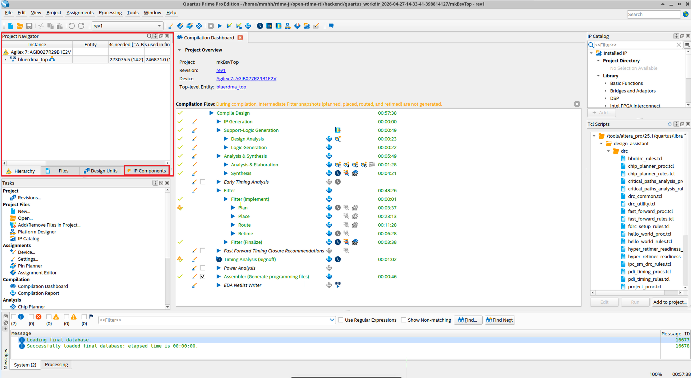
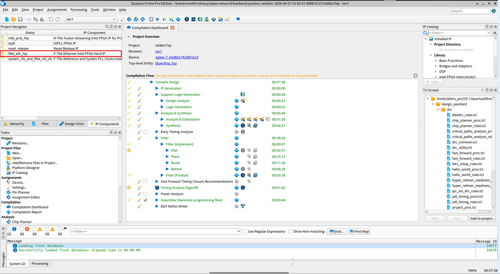
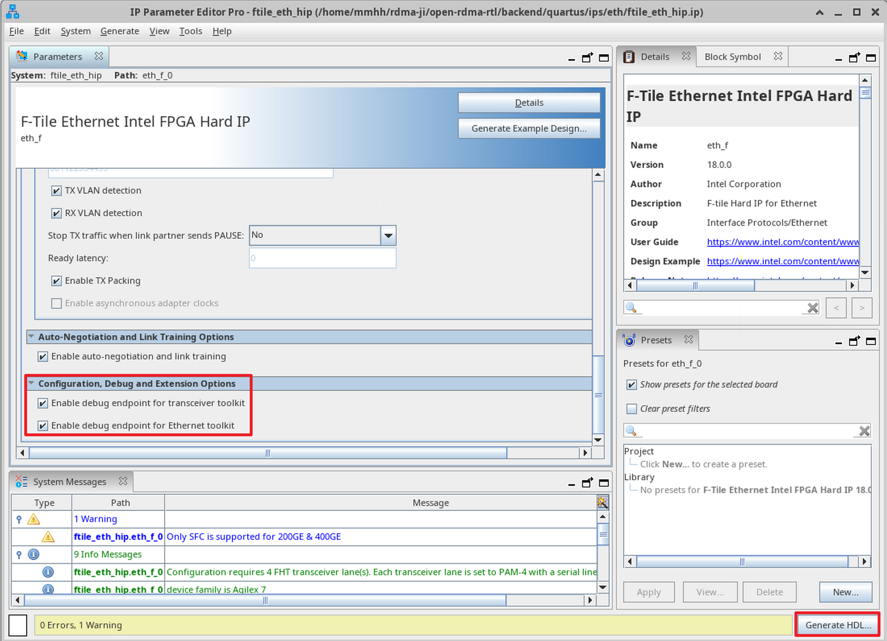
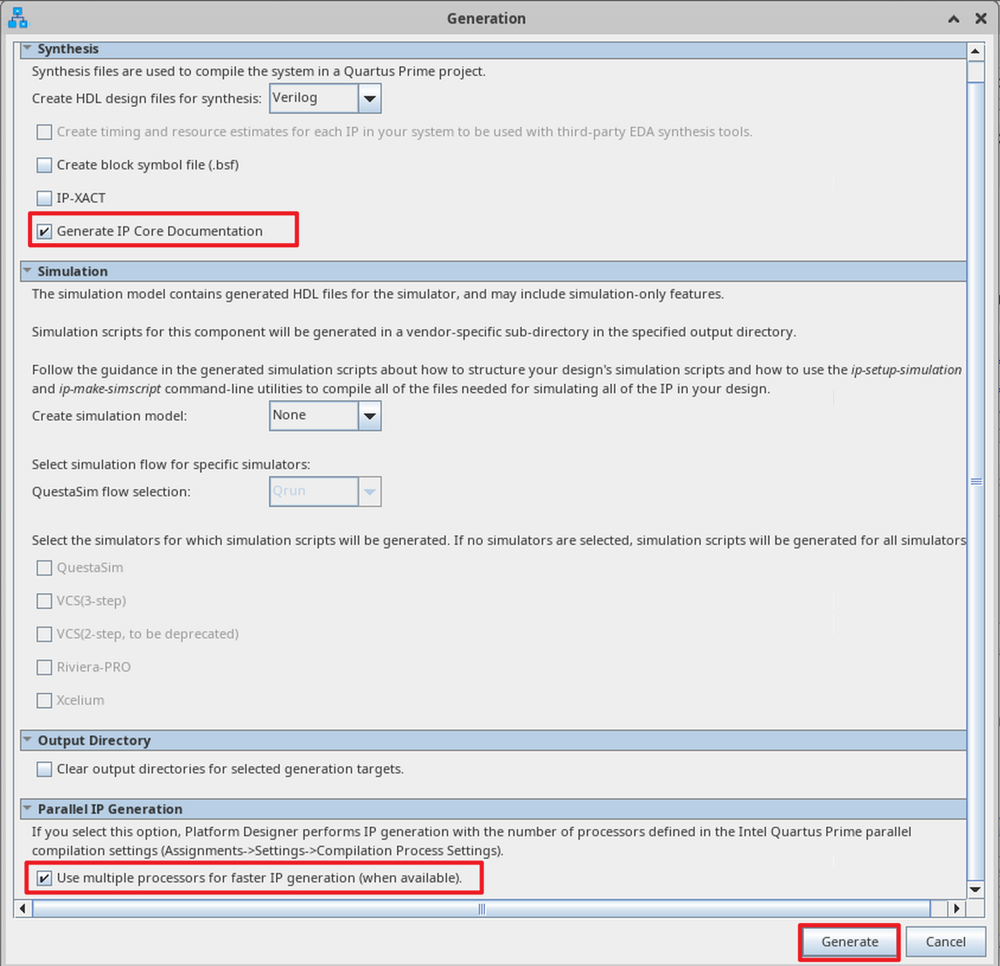
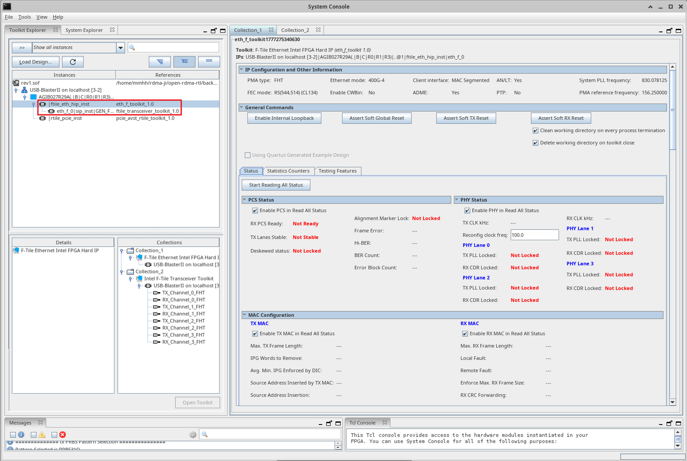
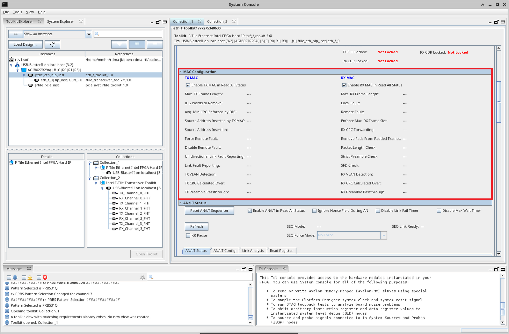
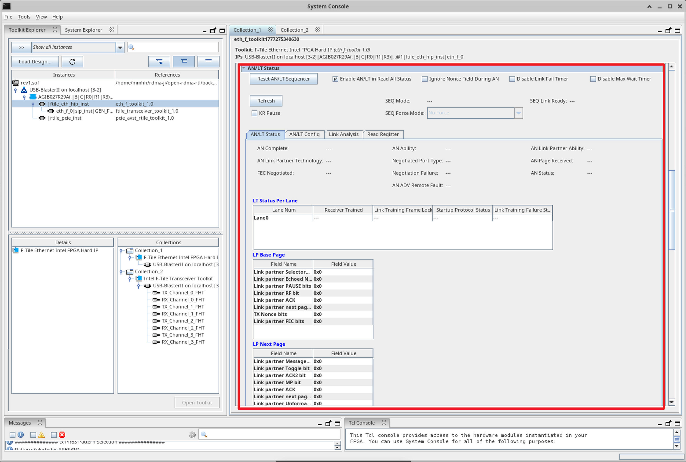
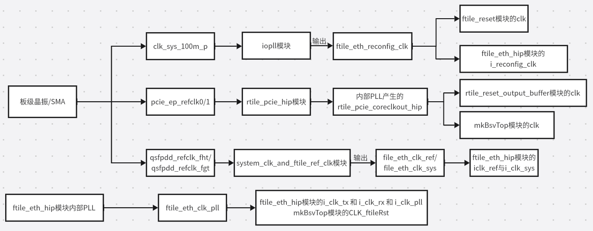

# FTile Debugging Project Operation Guide

## Configuring IP Cores and Enabling Debug Tools

Open the synthesized backend project by launching the `mkBsvTop.qpf` project under `quartus_workdir_timestamp`. In the left-side Project Navigator window, click IP Components at the bottom right:



Double-click the `ftile_eth_hip` IP core:



Click Close:


Scroll down and check the two checkboxes **Enable debug endpoint for transceiver toolkit** and **Enable debug endpoint for Ethernet toolkit** to activate debug endpoints for the transceiver toolkit and the Ethernet toolkit. Then click the **Generate HDL** button at the bottom right:



In the pop-up window, select the two checkboxes as shown below, then click **Generate**:



After completion, click **Close**, then close the IP core window:


## Recompile, Synthesize, and Program the FTile Debug Project

On a Linux system, enter the `backend` directory and execute:

```bash
make verilog
```

```bash
make quartus
```

Launch Quartus software. Go to File → Open Project and open the project. Under the newly created timestamped working directory (`quartus_workdir_timestamp`), open the `mkBsvTop.qpf` project:


From the Tools menu, open Programmer → Click Hardware Setup in the upper left → Select USB-Blaster (choose an appropriate clock frequency) → Add the `.sof` file → Check `Program/Configure` → Click Start. When the progress bar in the upper right corner shows 100% (Successful), the newly synthesized project has been programmed successfully.


## Launching System Console

Open System Console by clicking Tools → System Debugging Tools → System Console. System Console is essentially a JTAG-controlled register readout dashboard.


Double-click `file_eth_hip_inst eth_f_toolkit_1.0` (Ethernet Debug Toolkit) to open the debug interface:



## FTile Ethernet Debug Toolkit Indicator Analysis


- **PCS Status (Physical Coding Sublayer Status)**
  - **RX PCS Ready**: Indicates whether the receive-side PCS layer is ready.
  - **TX Lanes Stable**: Indicates whether the transmit lanes are stable.
  - **Deskewed status**: Indicates whether multiple lanes are aligned.
  - **Alignment Marker Lock**: A flag indicating that the PCS layer has identified and locked onto alignment markers from the received data stream.
  - **Frame Error**: Frame error count.
  - **Hi-BER**: High bit error rate flag.
  - **BER Count**: Bit error rate.
  - **Error Block Count**: Count of blocks that still contain errors after FEC decoding.
- **PHY Status (Physical Layer Status)**
  - **TX CLK kHz**: Clock frequency.
  - **Reconfig clock freq**: Reconfiguration interface clock frequency, i.e., the actual frequency of `ftile_eth_reconfig_clk`; 100 MHz is the standard value.
  - **PHY Lane X**: Physical layer status of each SerDes transmit/receive lane.
    - **TX PLL Locked**: Status of the transmit lane's phase-locked loop.
    - **RX CDR Locked**: Status of clock data recovery for the receive lane.



- **MAC Configuration**: Configuration registers and status registers of the MAC layer.



- **AN/LT (Auto-Negotiation / Link Training)**: Displays the status and configuration information of auto-negotiation and link training between Ethernet ports as defined by the IEEE 802.3 standard.

# Top-Level (top.v) Clock Tree

## Clock Tree Architecture Overview



FTile (Ethernet subsystem) and RTile (PCIe subsystem) each have independent reference clock sources and phase-locked loops. They do not share any PLL; interaction between them occurs only at the user logic level through cross-clock-domain processing.

## FTile Clock Path

Consists of three parts: configuration clock, reference clock, and high-speed data clock:

- **Configuration Clock**
  - **Source**: On-board 100 MHz oscillator input.
  - **Path**: After multiplication/division by the IOPLL, `ftile_eth_reconfig_clk` is generated.
  - **Purpose**: This clock operates at a relatively low, independent, and stable frequency. It is dedicated to driving the FTile reconfiguration interface and reset module, and does not participate in the high-speed data path, ensuring stability of the configuration process.
- **Reference Clock**
  - **Source**: `qsfpdd_refclk_fgt` and `qsfpdd_refclk_fht` from the QSFPDD optical module connector.
  - **Path**: These two clocks, after synchronization processing, serve as the system clock and reference clock inputs to the FTile core.
- **High-Speed Data Clock**
  - **Source**: Generated by the internal PLL of the FTile Ethernet HIP.
  - **Path**: After the internal PLL locks, it outputs `ftile_eth_clk_pll`.
  - **Purpose**: This clock serves simultaneously as the TX/RX serial data path clock for FTile and provides `CLK_ftileClk` to the user logic.

## RTile Clock Path

RTile's clock path is relatively straightforward, focusing on PCIe link stability:

- **Reference Clock**
  - **Source**: Typically the differential clock from the PCIe edge fingers, or an on-board oscillator.
  - **Path**: Input to the RTile PCIe HIP module.
- **Core Clock**
  - **Source**: Generated by the internal PLL of the RTile PCIe HIP.
  - **Path**: Generates `rtile_pcie_coreclkout_hip` and outputs it to the top-level `mkBsvTop.CLK`.
  - **Purpose**: Drives the PCIe core logic and user interface.

## Relationship between FTile and RTile

### Functional Positioning

- **RTile**: Implements the PCI Express protocol stack (R‑Tile PCIe Hard IP) and completes DMA data transfer between the host and the FPGA.
- **FTile**: Implements the high-speed Ethernet protocol stack (F‑Tile Ethernet Hard IP) and is responsible for data transmission and reception on the network side (e.g., 100G/400G).
- The two occupy different physical resources within the chip, and their pins do not overlap (PCIe lanes and QSFPDD lanes are independent), constituting a **decoupled design**.

### Complete Clock Domain Isolation

- **RTile Clock Source**: External PCIe reference clocks (`pcie_ep_refclk0/1`) are fed directly into the RTile IP, whose internal PLL generates the user-side interface clock `rtile_pcie_coreclkout_hip`.
- **FTile Clock Source**: External QSFPDD reference clocks (`qsfpdd_refclk_fgt/fht`) are processed by `system_clk_and_ftile_ref_clk` to produce `ftile_eth_clk_sys` and `ftile_eth_clk_ref`, and finally the FTile internal PLL generates the data path clock `ftile_eth_clk_pll`.
- **No shared clocks exist**. The `ftile_eth_reconfig_clk` generated by the IO PLL is used only for the FTile configuration interface and has no connection to RTile.

### Cascaded Dependency in Reset Logic

The reset sequence exhibits a dependency in which RTile stabilizes first, and FTile is released later.

This ensures that the PCIe-side power and clocks are stable before the Ethernet side is allowed to exit the reset state, meeting board-level power sequencing requirements.

### Data Path Interconnection via User Logic (mkBsvTop)

- `mkBsvTop` uses **two asynchronous clocks**:
  - `CLK` = `rtile_pcie_coreclkout_hip` (PCIe side)
  - `CLK_ftileClk` = `ftile_eth_clk_pll` (Ethernet side)
- Inside the user logic, **cross-clock-domain (CDC) processing** converts and encapsulates PCIe TLP data and Ethernet MAC frames for forwarding.
- Therefore, FTile and RTile are **completely decoupled physically and temporally, and interact only through a CDC bridge at the logical function level to pass data packets like a relay**.

### Architectural Advantages

High stability: rate changes or clock jitter on one side do not affect the other side, while also facilitating independent debugging and upgrades.

# ftile_reset.v — Reset Synchronization and Handshake Release Module

`ftile_reset` is a dedicated **reset synchronization and handshake release module** located between the RTile PCIe hard core and the FTile Ethernet hard core. It is responsible for safely transferring the global reset signal from the RTile side to the FTile clock domain, and through a hardware handshake protocol ensures that the FTile internal power, PLL, and calibration circuits are all ready before officially releasing the reset signal. This module is the critical bridge for implementing reliable system-level reset timing.

If `rtile_pcie_pin_perst_n_o` were directly connected to FTile's `i_rst_n`, the following risks would arise:

- **Timing risk**: The PLL and power inside FTile may not yet be stable; releasing reset prematurely can cause link training failure or unreliability.
- **Cross-clock-domain issues**: `rtile_pcie_pin_perst_n_o` resides in the RTile clock domain; direct connection to the FTile clock domain can produce metastability.
- **Lack of handshaking**: It cannot be guaranteed that the FTile IP has completed self-test and calibration (these may not be finished before `rst_ack_n` is pulled low).

This module ensures the strictness of the system-level power-on sequence.

# rtile_reset_output_buffer.v Analysis

`rtile_reset_output_buffer` is a **reset signal synchronization buffer** located between the RTile PCIe hard core and the user logic (`mkBsvTop`). It synchronizes the dynamic reset status signal `p0_reset_status_n` from the PCIe physical layer to the user logic clock domain through a four-stage shift register. While eliminating metastability, it also provides glitch filtering and fan-out buffering, delivering a stable and reliable global reset source for the entire user design.

- **Four-stage pipeline**:
  - **Physical implementation need for high-fanout reset networks**: The propagation of the reset signal is spread across multiple clock cycles to gradually expand the fan-out range. Quartus' Fitter tool can insert progressively larger buffers between these four register stages, keeping the load at each stage within manageable limits and greatly alleviating timing closure pressure on the global network.
  - **“Debounce” filtering for the PCIe hard core reset signal**: The multi-stage delay acts as a low-pass filter, ensuring that only a sustained stable reset release (high level) is passed to `o_reset_n`, preventing glitches during link training from falsely resetting user logic.
  - **Cross-clock-domain synchronization**: `i_reset_n` comes from `rtile_pcie_p0_reset_status_n`, which is an internally generated “physical layer ready” flag from the PCIe controller and may vary across clock domains during PCIe link training. This module uses a four-stage shift register to synchronize it to the `rtile_pcie_coreclkout_hip` (user logic main clock) domain, eliminating metastability.

Thus, the `RST_N` obtained by `mkBsvTop` is a strictly synchronized and glitch-free reset signal, ensuring the correct release sequence of the reset between the user logic and the PCIe hard core, and preventing premature start of business logic during link instability.