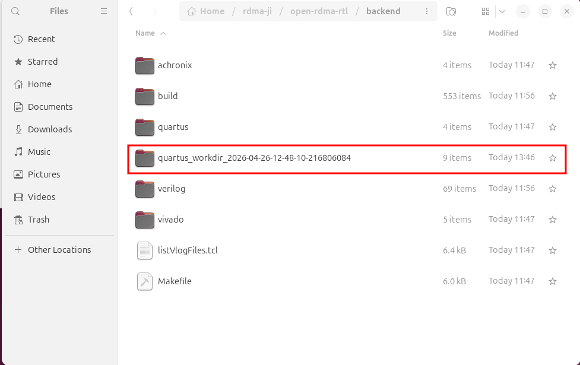
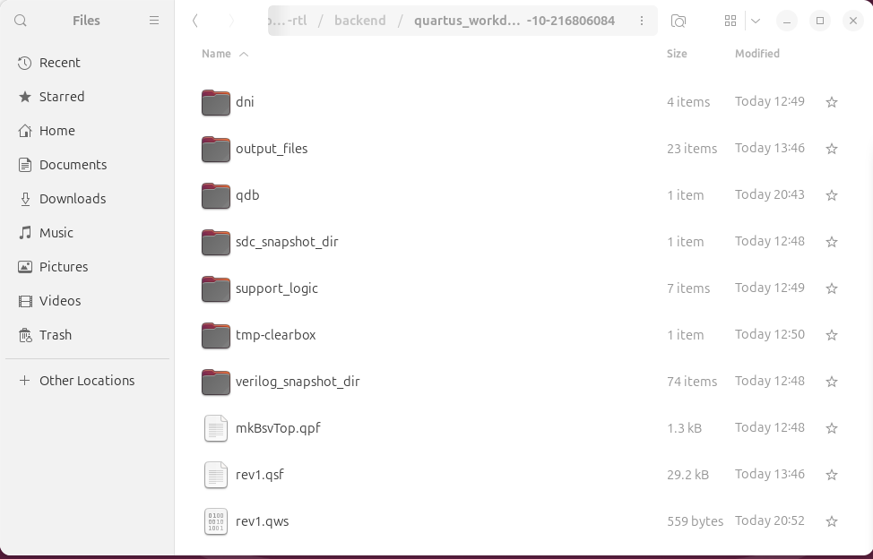
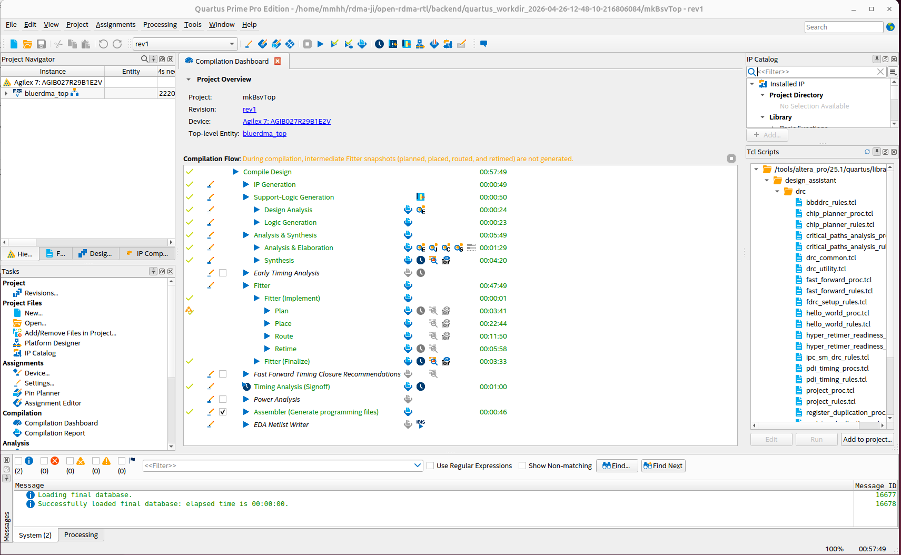
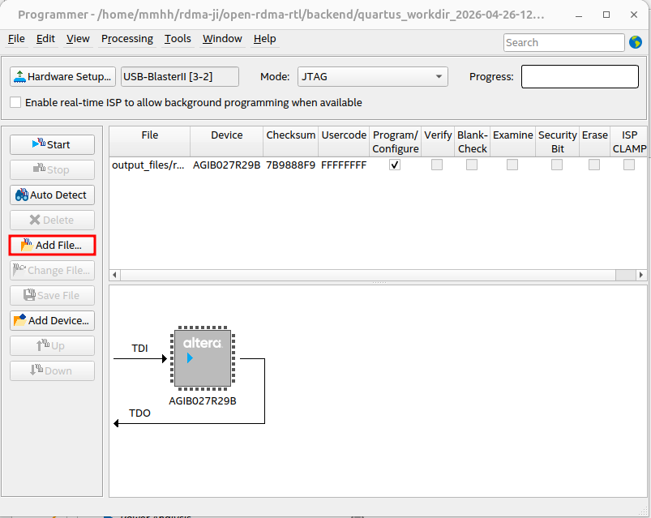
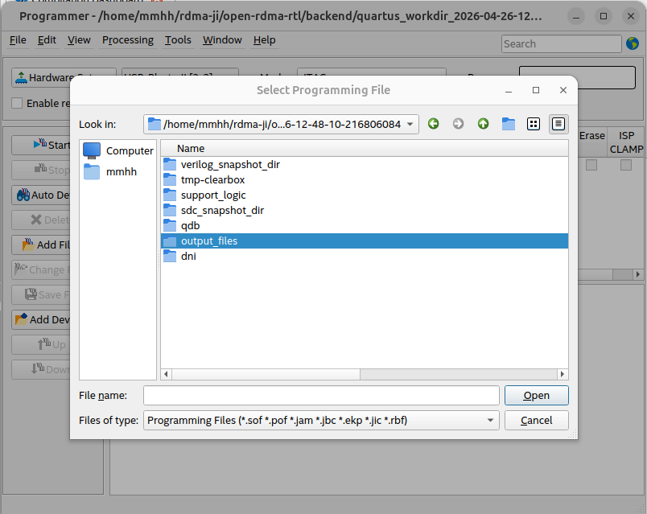
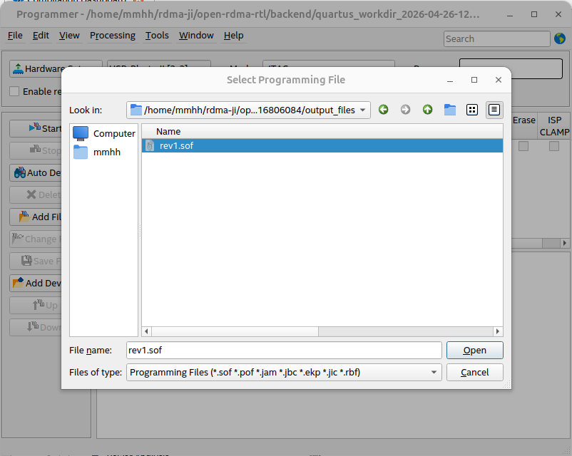
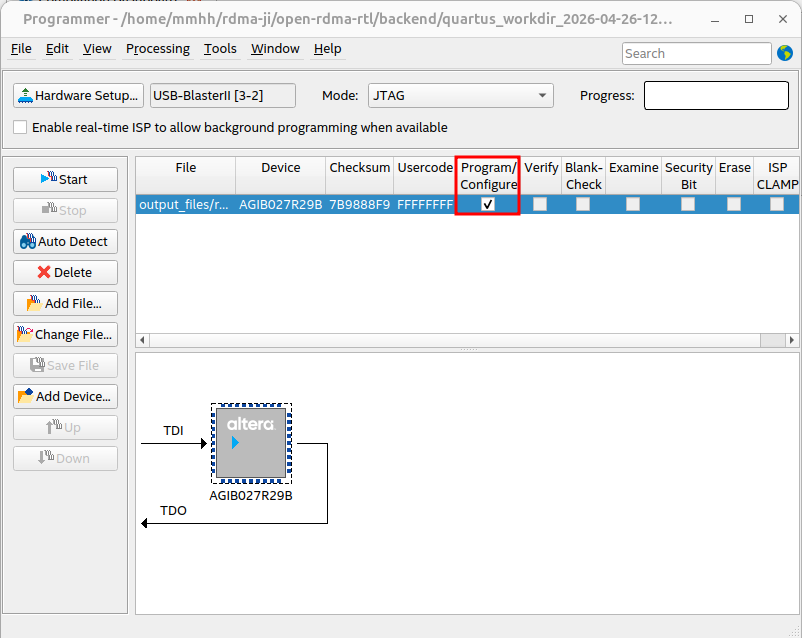

# 从源码编译到FPGA上板操作文档

## 编译RTL源码

linux系统进入backend目录执行

```bash
make verilog
```

可以看到编译后所创建的`build`和`verilog`两个文件夹：


## 启动后端综合工具综合

我们在此以Quartus为例，backend目录下执行

```bash
make quartus
```

创建了一个带有时间戳的工作目录：



打开该工作目录，`output_files` 存放 .sof 文件用于后续工程烧录，`sdc_snapshot_dir` 存放 sdc 时序约束文件的快照版本，`verilog_snapshot_dir`存放 verilog 源文件的快照版本，`mkBsvTop.qpf` 为工程文件，`rev1.qsf` 为设置文件。



## 下载程序到FPGA板卡

打开 Quartus 软件，左上角 File-Open Project 打开工程，在带有时间戳的工作目录（`quartus_workdir_时间戳`）下打开 `mkBsvTop.qpf` 工程：


打开后如下图所示，我们所执行的上述两条指令实际上就是执行了图中 Compilation Flow 下的操作：



上方Tools工具栏打开Programmer：


点击左上角Hardware Setup：


选择USB-Blaster，若USB-Blaster配置有问题，可去掉自动探测频率的复选框（`Auto-adjust frequency at chain scanning`），用已知可行的固定时钟调试。


关闭 Hardware Setup，点击Add File：



点击 output_files 文件夹



添加 .sof文件：



勾选 `Program/Configure` ：



点击 Start，待右上角进度显示 100%(Successful) 后即烧录成功。

# open-rdma硬件RTL代码仓库结构介绍

- backend：后端工程文件目录
- docs：架构图
- src：源码
- test：测试文件

- Makefile.base：基础配置库

# Makefile.base——基础编译配置

`Makefile.base`位于open-rdma-rtl文件夹下，是整个 open-rdma 硬件工程的 **编译配置基座**，它定义了 Bluespec 编译器 `bsc` 所需的所有通用标志、路径和参数。它与项目特有的 `Makefile` 之间通过 `include` 形成继承关系：`Makefile` 在第一行引入 `../Makefile.base`，从而获得其中全部的基础规则和变量，再在此基础上追加本项目的器件型号、后端路径、IP 类型等特定配置。

这种“基础配置 + 项目定制”的两层结构，实现了**高度参数化的构建系统**。`Makefile.base` 主要完成以下工作：

- **统一编译器行为**：集中管理 `bsc` 的转换优化（`TRANSFLAGS`）、调试检查（`DEBUGFLAGS`）、调度可视化（`SCHEDFLAGS`）、Verilog 生成（`VERILOGFLAGS`）等标志，确保所有模块采用一致的编译策略。
- **规范化目录结构**：通过 `BUILDDIR`、`OUTDIR`、`WORKDIR` 等变量将所有中间文件、输出 Verilog、仿真文件统一放置于 `build/` 目录下，使产物与源码隔离。
- **提供仿真与运行时支持**：设定仿真并行链接数（`BLUESIMFLAGS`）、运行时最大栈空间（`RUNTIMEFLAGS`）等，并对接外部 C 模型（如 `MockHost.c`）以支持软硬件协同验证。
- **定义平台与 IP 的抽象变量**：通过 `BLUE_RDMA_DMA_IP_TYPE`、`BLUE_RDMA_ETH_IP_TYPE`、`BLUERDMA_BUILD_TARGET` 等变量，配合条件判断，为不同硬件平台（Xilinx 100G / Intel 400G）和 IP 选择（XDMA、Blue DMAC、R‑Tile DMAC 等）自动切换包搜索路径、宏定义和数据总线宽度。
- **贯穿全流程的命令行生成**：这些变量会在 `compile`、`verilog` 等目标中组装成完整的 `bsc` 调用参数，使得开发者只需一条 `make` 命令即可从 BSV 源码生成适配特定硬件的 Verilog 代码。

正是由于 `Makefile.base` 的存在，open-rdma 项目实现了 **“一套 RTL 源码，多套 IP，一键切换目标平台”** 的灵活构建能力。它不仅大幅降低了人工配置的出错风险，也为后续接续 Quartus、Vivado 等后端综合工具提供了准确、稳定的高层描述。

# Makefile——自动化FPGA构建的总入口

## 功能概述

`backend/Makefile` 是整个 open-rdma 硬件工程的**顶层构建入口**。它向上承接 Bluespec 编译流程，向下驱动 Intel Quartus 或 Xilinx Vivado 后端实现。开发者只需在 `backend/` 目录下执行简单的 `make` 命令，就能完成从 BSV 源码到最终 FPGA 比特流（`.sof` / `.bit`）的全流程自动化。

该 Makefile 通过 `include ../Makefile.base` 继承公共的编译器标志和构建规则，并在此基础上针对本项目的具体需求扩展了后端相关的变量、条件分支和专有目标，形成“基础配置 + 项目定制”的两层结构。

## 流程

### 定义后端构建所需的核心变量

定义工作目录、源文件路径、约束文件路径、目标器件型号、通过时间戳生成隔离的工作目录等后端构建所需的核心变量。这些变量后续会被export成环境变量，传给quartus的tcl脚本使用。

## 平台选择：一套代码适配多硬件目标

通过条件判断变量 `BLUERDMA_BUILD_TARGET`，Makefile 能够自动切换 **Xilinx 100G** 和 **Intel 400G** 两套硬件平台：

- **XILINX_100G** 分支追加 Xilinx 厂商标识的 BSV 包搜索路径、Vivado 专有的 RTL 及 SDC 约束。
- **ALTERA_400G** 分支则引入 Altera 对应的源码路径和 Quartus 侧约束。

这种设计使得同一套 RTL 无需修改即可编译给不同 FPGA 器件。

### 编译目标选择

Makefile 中保留了大量被注释的 `TARGETFILE` 与 `BSV_TOP_MODULE` 组合，允许开发者快速将编译目标从完整的 `bluerdma_top` 切换至任一子模块的时序或功能测试用例（如 `TestRtilePcieAdaptor`、`TestCsrFramework` 等）。

### 环境变量导出

Makefile 将路径、器件、IP 类型等关键变量通过 `export` 提升为环境变量。这些变量会传递给后续的 Quartus/Vivado Tcl 脚本，使其能够读取 `$::env(DEVICE)`、`$::env(RTL_DIRS)` 等动态创建工程并添加文件。

### 编译并筛选Verilog文件

执行`make verilog`会先执行compile编译，编译后会在`backend`里创建`build`文件夹，之后调用 Bluespec 编译器 `bsc` 将 `.bsv` 转换为 Verilog，然后利用 `bluetcl` 辅助脚本自动收集生成的所有 `.v` 文件，统一复制到新建的 `verilog/` 目录。该目录即后端工具需要读取的 RTL 源文件聚集地。

### 启动后端综合

进入 Quartus 后端目录，以命令行模式运行 `non-project-build.tcl` 脚本。该脚本利用环境变量动态创建工程、添加 IP 和 RTL、配置时序约束与优化选项，最终调用 `execute_flow -compile` 完成从综合到时序收敛的全流程，输出 `.sof` 编程文件。

# non-project-build.tcl——Quartus自动化综合与实现脚本

## 概述

`non-project-build.tcl` 是整个 open-rdma 项目中 **Intel Quartus 后端流程的核心执行脚本**。它在 Makefile 的 `quartus` 目标中被调用，负责将 Makefile 通过环境变量传递的所有配置信息——器件型号、顶层模块、RTL 源文件、SDC 约束、IP 路径等——转化为一个完整的 Quartus 工程，并自动执行从综合到时序收敛的全编译流程，最终输出可直接下载到 FPGA 板卡的 `.sof` 编程文件。

## 流程总览

读取环境变量 —— 快照并收集整理源文件 —— 添加IP、RTL、SDC —— 打开/创建工程 —— 设置全局参数 —— 全局分配（器件、引脚、电源、时钟、优化） —— 导出分配 —— 执行完整编译 —— 关闭工程

## 流程概述

### 读取环境变量

从环境变量中读取 Quartus 后端工程主目录、编译工作目录、RTL 源文件搜索路径列表、SDC 时序约束文件的搜索路径、器件型号等信息。

### 快照并收集整理源文件

声明一个过程`build_snapshot_dir_and_file_list`，通过glob命令展开当前目录模式，去掉路径部分提取文件名，再拼出快照文件的完整路径，实现源文件复制到快照目录。

### 添加IP、RTL、SDC

声明一个过程`addFilesToProj`，将 IP、RTL 源文件、SDC 约束文件添加到 Quartus 工程。

### 打开/创建工程

操作工程前进行环境监察与冲突处理，若当前已打开其他不相干的工程，则先关闭；若目标工程文件已存在，直接打开；若不存在，则创建新工程。

### 全局分配

定义工程基本信息、配置硬件相关的管脚与功能、设置调试与分析选项、控制综合与布局布线的优化策略。相当于你在 Quartus GUI 图形界面里手动填写和勾选的所有工程设置，只是用代码代替了鼠标操作。

### 导出分配

保存所有工程设置到.qsf文件。

### 执行完整编译

`execute_flow -compile`实现综合、布局布线、STA、汇编生成.sof编程文件。

### 关闭工程

根据`need_to_close_project`决定是否调用`project_close`来清理。